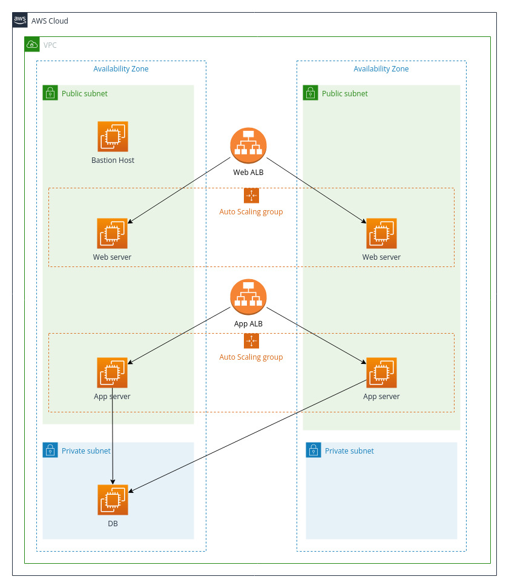

# Terraform Exercise

## Usage:
Before creating the architecture, please create a keypair in `eu-central-1`, `Frankfurt` region.

Once the keypair is created, please specify its name in `variables.tf`, under `ec2_key_pair`. This keypair is used for all launched EC2 instance.

I use Ubuntu AMIs from `eu-central-1` region, so we need to use that region.

Please specify your IP CIDR range in `variables.tf` under `my_public_ip_cidr`. This will limit SSH access to the Bastion Host to only the specified public ips. Currently it's set at `0.0.0.0/0` and is fully open.

If you want to limit access via HTTP to the load balancers, please specify your IP CIDR range in `variables.tf` under `http_ip_cidr`. Currently it's set at `0.0.0.0/0` and is fully open.

Build the architecture using `terraform apply`, it takes about 4 minutes to build completely. Once the architecture is built, the instances will still take about 1 minute to startup automatically.

Use `web_lb_dns_name` in the outputs to connect to the web servers and start using the service.

## Architecture:

All servers at startup download code from different github repositories. Ideally the code should be in an S3 bucket, but I chose to use github to avoid costs with public S3 buckets.

Everything autostarts on the different EC2 instances, all the servers are running a docker container with the different applications.
### Bastion Host:

Security group open on port `22` to specified IPs. Connect to the Bastion host using the specified keypair with the user `ubuntu`.

### Web ALB:

Security group open on port `80` to specified IPs.

### Web server:

Security group open on port `80` to specified web ALB. Security group open on port `22` to Bastion Host.

Web servers offer a simple webpage that will interact with the App servers via REST API.

Connect to the Web servers from the Bastion Host using the specified keypair with the user `ubuntu`.

View the Web server code at https://github.com/ansaldimatteo/simple-website

### App ALB:

Security group open on port `80` to specified IPs.

### App server:

Security group open on port `80` to specified web ALB. Security group open on port `22` to Bastion Host.

Please view [`exercise-openapi.yml`](docs/exercise-openapi3.yml) to view the REST API calls.

Connect to the App servers from the Bastion Host using the specified keypair with the user `ubuntu`.

View the App server code at https://github.com/ansaldimatteo/simple-flask-app

### DB server:

We are running MySQL as a DB.

Security group open on port `3306` to App servers. Security group open on port `22` to Bastion Host.

Connect to the DB server from the Bastion Host using the specified keypair with the user `ubuntu`.

View the DB code at https://github.com/ansaldimatteo/mysql-docker